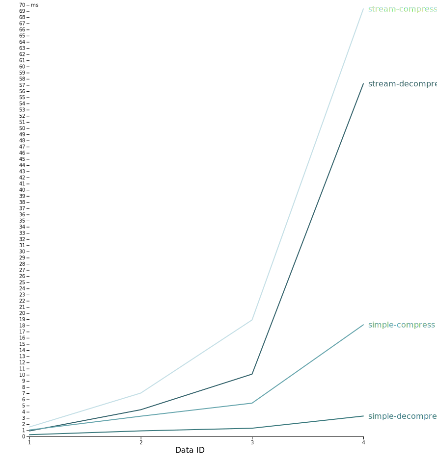

[](https://www.npmjs.com/package/@oneidentity/zstd-js)

# The OneIdentity ZSTD library

The One Identity ZSTD library is a fast and small browser-side compression library, based on the official Zstandard library.
Due to its extensive browser support (including Internet Explorer support), the One Identity ZSTD library is also suitable for enterprise environments.

Before you import and initialize the library packages, run this command in your terminal:

```shell
yarn add @oneidentity/zstd-js
```

or

```shell
npm install @oneidentity/zstd-js
```

# Importing the library packages

To import the library packages, include the following function in your .js file:

```ts
import {ZstdInit} from '@oneidentity/zstd-js';
```

# Initializing the library packages

To initialize the imported library packages, include the following function in your .js file:

```ts
import {ZstdInit, ZstdCodec} from '@oneidentity/zstd-js';

ZstdInit().then(({ZstdSimple, ZstdStream}: ZstdCodec) => {
  // You can use the library from now
});
```

**TIP**: Failing to initialize the library packages before using their functions may result in an [initialization issue](#troubleshooting).
To avoid this, One Identity recommends that you initialize the library packages immediately after you import them.

# Parameters

## Required parameters

```ts
import {ZstdInit, ZstdDec} from '@oneidentity/zstd-js';

ZstdInit().then(({ZstdSimple, ZstdStream}: ZstdCodec) => {
  // Create some sample data to compress
  const data = new Uint8Array(Array.from({length: 1000}, (_, i) => i % 256));

  /*
   * The required parameter is the data
   * It must be a Uint8Array
   * */
  const compressedSimpleData: Uint8Array = ZstdSimple.compress(data);

  const compressedStreamData: Uint8Array = ZstdStream.compress(data);
});
```

## Optional parameters

```ts
import {ZstdInit, ZstdDec} from '@oneidentity/zstd-js';

ZstdInit().then(({ZstdSimple, ZstdStream}: ZstdCodec) => {
  // Create some sample data to compress
  const data = new Uint8Array(Array.from({length: 1000}, (_, i) => i % 256));

  const compressionLevel = 20;
  const doCheckSum = true;

  /*
   * The library supports regular compression levels from 1 up to 22.
   * Levels >= 20, labeled `--ultra`, should be used with
   * caution, as they require more memory. The library also offers negative
   * compression levels, which extend the range of speed vs. ratio preferences.
   * The lower the level, the faster the speed (at the cost of compression).
   * You can set compression level as an optional parameter (default compression level: 3)
   * More info: https://facebook.github.io/zstd/zstd_manual.html
   * */
  const compressedSimpleData: Uint8Array = ZstdSimple.compress(data, compressionLevel);

  /*
   * A 32-bits checksum of content is written at end of frame
   * In Stream you can set compression level and checksum as well (default compression level: 3, default checkSum: false)
   * More info: https://facebook.github.io/zstd/zstd_manual.html
   * */
  const compressedStreamData: Uint8Array = ZstdStream.compress(data, compressionLevel, doCheckSum);
});
```

# Use cases: which library package and module to import

| Import the following One Identity ZSTD library package: | If you want to provide support for these browsers: | If you want to use the following function: | Module     | Package size |
| :------------------------------------------------------ | :------------------------------------------------- | :----------------------------------------- | :--------- | :----------- |
| `@oneidentity/zstd-js`                                  | all browsers                                       | compress and decompress                    | asm & wasm | 2182 kbit    |
| `@oneidentity/zstd-js/decompress`                       | all browsers                                       | decompress                                 | asm & wasm | 365 kbit     |
| `@oneidentity/zstd-js/wasm`                             | [modern browsers](#browser-compatibility)          | compress and decompress                    | wasm       | 753 kbit     |
| `@oneidentity/zstd-js/wasm/decompress`                  | [modern browsers](#browser-compatibility)          | decompress                                 | wasm       | 150 kbit     |
| `@oneidentity/zstd-js/asm`                              | [legacy browsers](#browser-compatibility)          | compress and decompress                    | asm        | 1439 kbit    |
| `@oneidentity/zstd-js/asm/decompress`                   | [legacy browsers](#browser-compatibility)          | decompress                                 | asm        | 225 kbit     |

# Example use cases

## The following examples illustrate how you can use the One Identity ZSTD library packages in the following functions and cases:

- [Using the packages with promise](#using-the-packages-with-promise)
- [Using the packages in an asynchronous function](#using-the-packages-in-an-asynchronous-function)
- [Using the packages in an asynchronous function with import](#using-the-packages-in-an-asynchronous-function-with-import)
- [Using the packages for the decompress function only](#using-the-packages-for-the-decompress-function-only)

**Note:** If you pull one of the decompress packages (for example @oneidentity/zstd-js/decompress), using the ZstdCodec interface is not supported.
For decompress packages, you can only use the ZstdDec interface, which returns the same object, but you will not be able to use the compress methods on the ZstdSimple and the ZstdStream.
For more information, see [Using the packages for the decompress function only](#using-the-packages-for-the-decompress-function-only).

### Using the packages with promise

```ts
import {ZstdInit, ZstdCodec} from '@oneidentity/zstd-js';

ZstdInit().then(({ZstdSimple, ZstdStream}: ZstdCodec) => {
  // Create some sample data to compress
  const data = new Uint8Array(Array.from({length: 1000}, (_, i) => i % 256));

  // Compress it with ZstdSimple
  const compressedSimpleData: Uint8Array = ZstdSimple.compress(data);

  // Compress it with ZstdStream
  const compressedStreamData: Uint8Array = ZstdStream.compress(data);

  // Decompress the compressed simple data
  const decompressedSimpleData: Uint8Array = ZstdSimple.decompress(compressedStreamData);

  // Decompress the compressed stream data
  const decompressedStreamData: Uint8Array = ZstdStream.decompress(compressedStreamData);

  console.log('[Simple]: ', decompressedSimpleData); // [Simple] [0,1,2,3,4...]
  console.log('[Stream]: ', decompressedStreamData); // [Stream] [0,1,2,3,4...]
});
```

### Using the packages in an asynchronous function

```ts
import {ZstdInit, ZstdCodec} from '@oneidentity/zstd-js';

(async () => {
  // Save the return value of the init into variables
  const {ZstdSimple, ZstdStream}: ZstdCodec = await ZstdInit();

  // Create some sample data to compress
  const data = new Uint8Array(Array.from({length: 1000}, (_, i) => i % 256));

  // Compress it with ZstdSimple
  const compressedSimpleData: Uint8Array = ZstdSimple.compress(data);

  // Compress it with ZstdStream
  const compressedStreamData: Uint8Array = ZstdStream.compress(data);

  // Decompress the compressed simple data
  const decompressedSimpleData: Uint8Array = ZstdSimple.decompress(compressedStreamData);

  // Decompress the compressed stream data
  const decompressedStreamData: Uint8Array = ZstdStream.decompress(compressedStreamData);

  console.log('[Simple]: ', decompressedSimpleData); // [Simple]: [0,1,2,3,4...]
  console.log('[Stream]: ', decompressedStreamData); // [Stream]: [0,1,2,3,4...]
})();
```

### Using the packages in an asynchronous function with import

```ts
import {ZstdInit, ZstdSimple, ZstdStream} from '@oneidentity/zstd-js';

(async () => {
  await ZstdInit();
  // Create some sample data to compress
  const data = new Uint8Array(Array.from({length: 1000}, (_, i) => i % 256));

  // Compress it with ZstdSimple
  const compressedSimpleData: Uint8Array = ZstdSimple.compress(data);

  // Compress it with ZstdStream
  const compressedStreamData: Uint8Array = ZstdStream.compress(data);

  // Decompress the compressed simple data
  const decompressedSimpleData: Uint8Array = ZstdSimple.decompress(compressedStreamData);

  // Decompress the compressed stream data
  const decompressedStreamData: Uint8Array = ZstdStream.decompress(compressedStreamData);

  // Log out the results
  console.log('[Simple]: ', decompressedSimpleData); // [Simple]: [0,1,2,3,4...]
  console.log('[Stream]: ', decompressedStreamData); // [Stream]: [0,1,2,3,4...]
})();
```

### Using the packages for the decompress function only

```ts
import {ZstdInit, ZstdDec} from '@oneidentity/zstd-js/decompress';

ZstdInit().then(({ZstdSimple, ZstdStream}: ZstdDec) => {
  // Load the compressed data
  const someCompressedData: Uint8Array = loadCompressedData();

  // Decompress the compressed simple data
  const decompressedSimpleData: Uint8Array = ZstdSimple.decompress(someCompressedData);

  // Decompress the compressed stream data
  const decompressedStreamData: Uint8Array = ZstdStream.decompress(someCompressedData);

  console.log('[Simple]', decompressedSimpleData);
  console.log('[Stream]', decompressedStreamData);
});
```

# Library components and their functions

The One Identity ZSTD library is a browser-side compression library, based on the official Zstandard library.
The One Identity ZSTD library has the following components and functions:

| Component name | Component function                                             | Component description                                                                                                                                                                                                                                                        |
| -------------- | -------------------------------------------------------------- | ---------------------------------------------------------------------------------------------------------------------------------------------------------------------------------------------------------------------------------------------------------------------------- |
| Zstandard      | Compression algorithm                                          | [Zstandard](https://github.com/facebook/zstd) (abbreviated as zstd) is a fast lossless compression algorithm, targeting real-time compression scenarios at zlib-level and better compression ratios.                                                                         |
| WebAssembly    | Binary instruction format                                      | [WebAssembly](https://webassembly.org/) (abbreviated Wasm) is a binary instruction format for a stack-based virtual machine. Wasm is designed as a portable compilation target for programming languages, enabling deployment on the web for client and server applications. |
| asm.js         | An extraordinarily optimizable, low-level subset of JavaScript | The [Assembly](http://asmjs.org/) (abbreviated asm) language used for the One Identity ZSTD library is responsible for breaking down incoming data into system-specific JavaScripts.                                                                                         |
| Emscripten     | Compiler and wrapper                                           | [Emscripten](https://github.com/emscripten-core/emscripten) compiles C and C++ to WebAssembly using LLVM and Binaryen. Emscripten output can run on the Web, in Node.js, and in wasm runtimes.                                                                               |

# Supported functions and package limitations

## Functions

The One Identity ZSTD library currently supports the following functions:

- compress and decompress
- decompress

## Package limtations

**Note:** If you pull one of the decompress packages (for example @oneidentity/zstd-js/decompress), using the ZstdCodec interface is not supported.
For decompress packages, you can only use the ZstdDec interface, which returns the same object, but you will not be able to use the compress methods on the ZstdSimple and the ZstdStream.
For more information, see [Using the packages for the decompress function only](#using-the-packages-for-the-decompress-function-only).

# Browser compatibility

**Modern browsers:** Google Chrome, Firefox, Edge  
**Legacy browsers:** Internet Explorer (IE)

|  |  |  |  |
| --------------------------------------- | ----------------------------------------- | ----------------------------------- | ------------------------------- |
| Google Chrome                           | Firefox                                   | Edge                                | IE                              |
| 55+                                     | 52+                                       | 15+                                 | 10+                             |

# Performance test details

### The performance tests were conducted using the following four images:

| Data ID | Resolution            | File size |
| :------ | :-------------------- | :-------- |
| 1       | 1280 x 720 (HD)       | 564 kbit  |
| 2       | 1920 x 1080 (Full HD) | 1595 kbit |
| 3       | 2560 x 1440 (Quad HD) | 2588 kbit |
| 4       | 3840 x 2160 (4K)      | 6162 kbit |



### The performance tests were conducted in the following test system environment:

| Part       | Details           |
| ---------- | ----------------- |
| **CPU**    | i5-7440HQ 2.8Ghz  |
| **Memory** | DDR4 2400Mhz 32GB |

**The performance tests were based on the average time of 1000 runs for each image, and each function (stream-compress, stream-decompress, simple-compress, and simple-decompress).**

**For further details, see** [the exact measurement results](readme/data/zstd.data.json).

# Troubleshooting

By default, you may encounter error messages from the Asm, Wasm, or ZSTD side. The One Identity ZSTD library has an additional custom error message that you may encounter:

### Library package not initialized

If you do not initiate the Zstd library package before using its functions, you will get a similar error message:  
**Error: Zstd library not initialized. Please call the ZstdInit before usages**

For example:

```ts
import {ZstdStream} from '@oneidentity/zstd-js';

try {
  ZstdStream.compress(UInt8Array);
} catch (e) {
  console.log(e.message); // Error: Zstd library not initialized. Please call the ZstdInit before usages
}
```

To fix the issue, [initialize the library packages](#initializing-the-library-packages) before use.

For a full list of error messages from the ZSTD side, see [the zstd 1.4.7 Manual](https://facebook.github.io/zstd/zstd_manual.html).

# Questions & Answers

### Q: **There is** a separate compress and decompress, and a separate decompress function. Is there a separate compress function as well?

A: [As observed by our GitHub community](https://github.com/facebook/zstd/tree/master/contrib/single_file_libs#full-library), it's possible to create a compressor-only library but since the decompressor is so small in comparison, this doesn't bring much of a gain.
